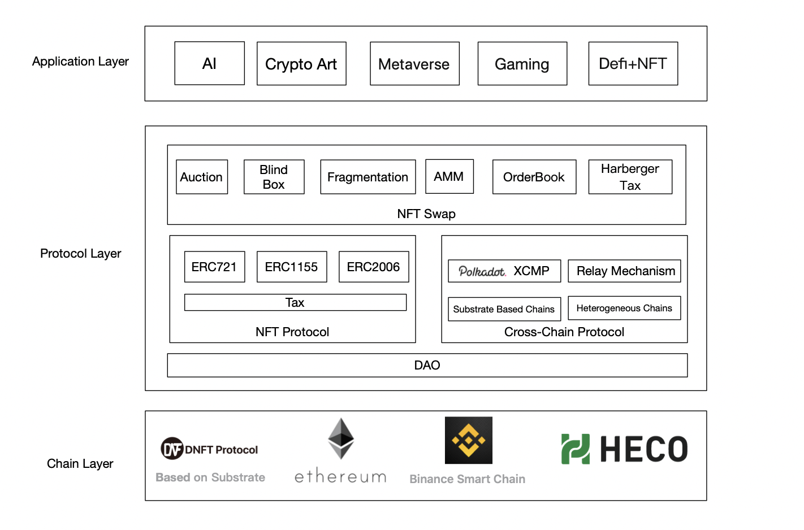
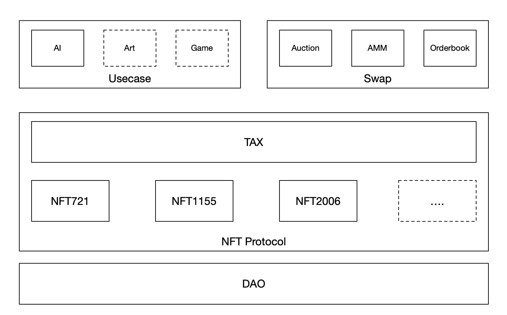

# DNFT

###### New generation cross chain NFT asset protocol for big data + real scenarios， Ready for hacking :rocket:

# 1.Introduce

[Substrate](https://github.com/substrate-developer-hub/substrate-node-template) Version for [DNFT Protocol](https://dnft.gitbook.io/dnft/).

# 2.Overview of DNFT Protocol



# 3.Core Module of DNFT Substrate Chain



**3.1 DAO**

- DAO Account for NFT collection.
- DAO Tax for NFT tax , Our team believes NFT with tax will be beneficial to the proliferation of NFT assets.
- DAO Proposal for NFT tax setting, etc.

**3.2 NFT Protocol**

- NFT721, a realization of [ERC721](https://eips.ethereum.org/EIPS/eip-721)

- NFT1155, a realization of [ERC1155](https://eips.ethereum.org/EIPS/eip-1155)

- NFT2006, an AI-friendly NFT framework, proposed by [DNFT Team](https://github.com/DNFT-Team)

  **Brief introduction**：

  A memorial to [deep learning](https://en.wikipedia.org/wiki/Deep_learning) , proposed in 2006, which has brought leaping development to the field of Artificial Intelligence. NFT2006 aims to make an easy adaption to NFT with data/model in AI field.

  **Features**:

  - [x] Aggregate multiple NFT, package into one，called Collection. It will be friendly for packaging multiple personal data into a big set.

  - [x] NFT fragmentation into Token(ERC20), friendy for huge Dataset ownership(especially for public data), which will friendly support for NFT mining in AMM/orderbook handling.

  - [ ] Copyright protection, authorized viewing using ZKP,MPC and other cryptography tricks.(To do)

  - [ ] Discussion in [EIP](https://github.com/ethereum/EIPs/) with NFT2006.

  **Detail**：

  1)DOC [erc2006-doc](https://dnft.gitbook.io/dnft/erc-nft-2006-standard)

  2)ERC2006-solidity version[erc2006-solidity](https://github.com/DNFT-Team/ERC2006)

**3.3 NFT Protocol**

- Simple Transfer or with a offer(in NFT Protocol)
- Auction(Simple implementation，will be perfect and optimized in the future )
  - [x] EnglishAuction(higher price bidder win the auction)
  - [x] DutchAuction(Price reduction until the winner comes)
  - [ ] SealedAuction(To do)
  - [ ] DoubleAuction(To do)
  - [ ] HabergerTaxAuction(To do)
- OrderBook(Only support NFT2006)
- AMM(Only support NFT2006)

**3.4 Usecase**

- AI
  - [x] AIData
  - [x] AIModel
- Game(To do)
- Art(To do)

**3.5 EVM-Support**

- [ ] EVM-Support

**3.6 Cross-Chain**

- [ ] XCMP-Support for Substrate-based Cross Chain
- [ ] Relay Mechanism for Heterogeneous blockchains Cross Chain (eg. ETH/BSC/Heco)
- [ ] NFT Cross Chain Mechanism

# 4.Build&Run

###### 4.1Build

**Install Rust:**

```
curl https://sh.rustup.rs -sSf | sh
```

**Initialize your Wasm Build environment:**

```
./scripts/init.sh
```

**Build Wasm and native code:**

```
cargo build --release
```

**[Build Error Handle Refer](https://github.com/DNFT-Team/dnft-substrate-node/blob/master/doc/Build%20Error%20%26%20Handle.md)**

###### 4.2Test

```
cargo test
```

###### 4.3Run

**Purge any existing developer chain state:**

```
./target/release/dnft purge-chain --dev
```

**Start a development chain with:**

```
./target/release/dnft --dev
```

**Start a development chain support outer ip call with:**

```
./target/release/dnft --dev --ws-external
```

###### 4.4Run in Docker

First, install [Docker](https://docs.docker.com/get-docker/) and [Docker Compose](https://docs.docker.com/compose/install/).

Then run the following command to start a single node development chain.

```
./scripts/docker_run.sh
```

This command will firstly compile your code, and then start a local development network. You can also replace the default command (`cargo build --release && ./target/release/dnft --dev --ws-external`) by appending your own. A few useful ones are as follow.

```
# Run Substrate node without re-compiling
./scripts/docker_run.sh ./target/release/dnft --dev --ws-external

# Purge the local dev chain
./scripts/docker_run.sh ./target/release/dnft purge-chain --dev

# Check whether the code is compilable
./scripts/docker_run.sh cargo check
```
